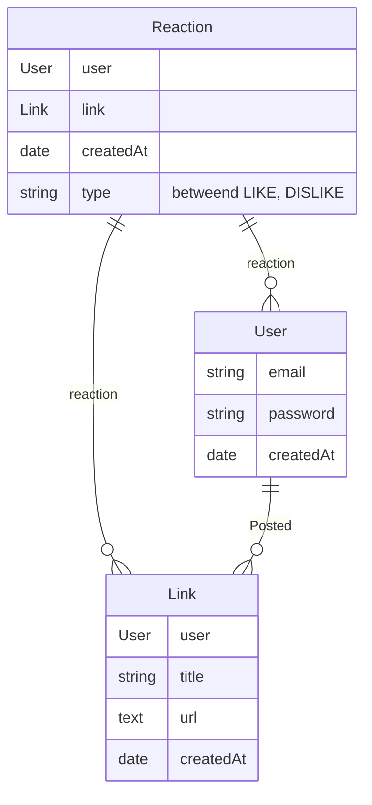

Pour ce projet, on va avoir besoin de définir la structure de la base de données.

Pour cette partie, **on ne va pas créer l’entité User.**

### Ressources

- [Doctrine and Symfony](https://symfony.com/doc/current/doctrine.html)

### Connexion à la base

Modifier le connecteur à la base pour qu'il utilise **SQLite**

>[!NOTICE] Expliquer ce qu'est le fichier **.env**

>[!NOTICE] Expliquer pourquoi il faut changer le connecteur à la base de données

### Créer les entités

En utilisant la commande `make:entity`, on va créer les entités **Link** et **Reaction** qui n’auront pas de gestion des utilisateurs pour le moment :

>[!NOTICE] Commencer à réfléchir aux relations à définir entre les entités (Many To One/Many To Many/...) ?
