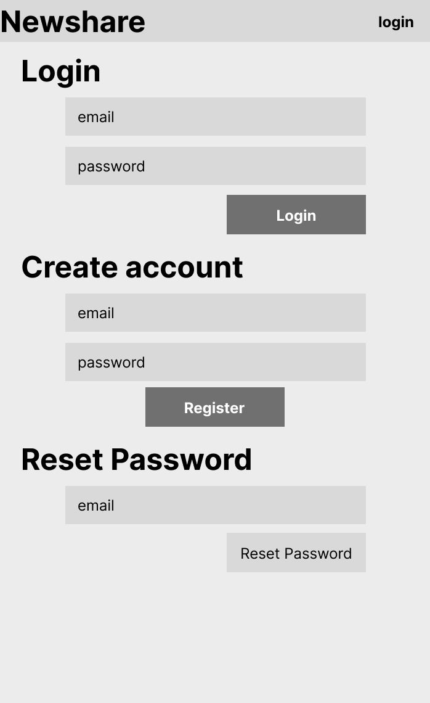
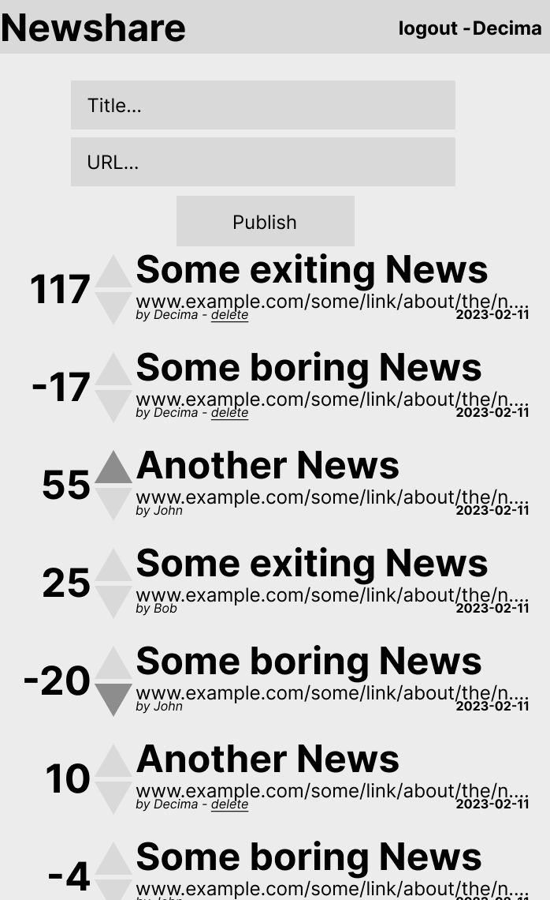

Ce TP consiste à créer une application de partage de fichiers nommée "Newshare" en utilisant le framework Symfony. L'objectif est de mettre en pratique les concepts appris dans les cours précédents et de se familiariser avec le framework Symfony.

## Objectif

Réaliser un système de news sharing avec Symfony, à la “reddit”, sans la partie commentaires.

## Fonctionnalités

- Publier un lien
- S'inscrire/Se connecter
- Voir les derniers liens publiés
    - Voir les liens publiés par une personne
    - Voir ses liens up-voted/down-voted
- Voter pour des liens
- Supprimer ses liens
- Donner un score aux gens qui publient, leur “karma”.

> [!NOTICE] Les blocs quote (ce bloc par exemple), sont des questions à répondre pour vous aider à comprendre le fonctionnement du framework
> Répondre aux questions dans le fichier **README.md** du projet.

</aside>

## Wireframes

<columns>

</columns>

